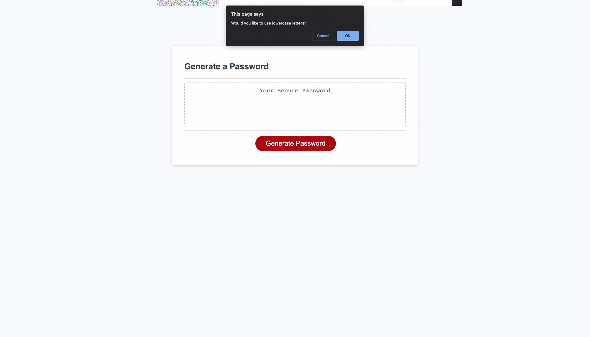

# Random Password Generator

## Project Intro
In order to ensure the security of sensitive data across a company, employees will need to have a way to access it using keys that can be created quickly and securely. For highly sensitive data, more complex and longer passwords will be needed.

## Project Goal
The goal of this project was to create a random password generator that will be flexible to the needs of the user. The generator needed to satisfy the following conditions: 

1. WHEN I click the button to generate a password
THEN I am presented with a series of prompts for password criteria

2. WHEN prompted for password criteria
THEN I select which criteria to include in the password

3. WHEN prompted for the length of the password
THEN I choose a length of at least 8 characters and no more than 128 characters

4. WHEN asked for character types to include in the password
THEN I confirm whether or not to include lowercase, uppercase, numeric, and/or special characters

5. WHEN I answer each prompt
THEN my input should be validated and at least one character type should be selected

6. WHEN all prompts are answered
THEN a password is generated that matches the selected criteria

7. WHEN the password is generated
THEN the password is either displayed in an alert or written to the page

